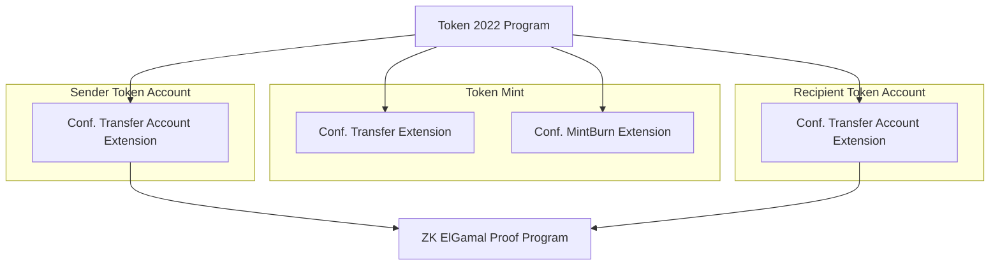

# Confidential Balances Product Guide

## Introduction

Confidential Balances is a set of **Token-2022 (Token Extensions) program** extensions that enable privacy on Solana asset transfers.

### Token-2022 Program

Token-2022 is Solana's extensible token program that maintains backwards compatibility with the original Token program while adding modular features via extensions.

- **Program ID**: `TokenzQdBNbLqP5VEhdkAS6EPFLC1PHnBqCXEpPxuEb`
- **Extension System**: Allows opt-in features to be added to mints and token accounts
- **Immutability**: Extensions must be configured at creation time (cannot be added later)

### Confidential Transfer Extensions

The following extensions work together to enable confidential transfers:

| Extension | Extension Type | Applied To | Purpose |
|-----------|----------------|------------|---------|
| **[ConfidentialTransferMint](https://github.com/solana-program/token-2022/tree/main/program/src/extension/confidential_transfer)** | `ExtensionType(11)` | Mint | Core transfer privacy - configures mint settings |
| **[ConfidentialTransferAccount](https://github.com/solana-program/token-2022/tree/main/program/src/extension/confidential_transfer)** | `ExtensionType(12)` | Token Account | Stores encrypted balances and encryption keys |
| **[ConfidentialTransferFeeConfig](https://github.com/solana-program/token-2022/tree/main/program/src/extension/confidential_transfer_fee)** | `ExtensionType(13)` | Mint (Optional) | Private fee handling |
| **[ConfidentialMintBurn](https://github.com/solana-program/token-2022/tree/main/program/src/extension/confidential_mint_burn)** | `ExtensionType(33)` | Mint (Optional) | Private token issuance |

**Note**: See the [Token Extensions Architecture](../reference/token-extensions.md) guide for detailed program-level implementation.

## Privacy Levels

Instead of an all-or-nothing approach, these token extensions allow varying degrees of configurable privacy:

| Level | Description | Use Case |
|-------|-------------|----------|
| **Disabled** | No confidentiality | Standard public tokens |
| **Whitelisted** | Only approved accounts | Regulated environments |
| **Opt-in** | Users enable when wanted | Maximum flexibility |
| **Required** | All transfers must be confidential | Maximum privacy |

## How Confidentiality Works

Confidentiality is achieved with several encryption techniques:

### Cryptographic Primitives

```
┌─────────────────────────────────────────────────────────────┐
│                  CRYPTOGRAPHIC STACK                        │
├─────────────────────────────────────────────────────────────┤
│                                                             │
│  ┌─────────────────────┐                                   │
│  │  Homomorphic        │  Enables arithmetic on            │
│  │  Encryption         │  encrypted balances               │
│  │  (ElGamal)          │                                   │
│  └─────────────────────┘                                   │
│            │                                               │
│            ▼                                               │
│  ┌─────────────────────┐                                   │
│  │  Symmetric          │  Efficient balance                │
│  │  Encryption         │  viewing by owner                 │
│  │  (AES)              │                                   │
│  └─────────────────────┘                                   │
│            │                                               │
│            ▼                                               │
│  ┌─────────────────────┐                                   │
│  │  Zero-Knowledge     │  Proves integrity without         │
│  │  Proofs             │  revealing amounts                │
│  │  (Range, Equality)  │                                   │
│  └─────────────────────┘                                   │
│                                                             │
└─────────────────────────────────────────────────────────────┘
```

### Built-in Compliance

Token issuers can optionally assign **global auditors** for regulated jurisdictions. Auditors have the ability to decrypt:
- Account balances
- Transfer amounts

This enables KYC, AML, and other compliance requirements while maintaining user privacy.

## Architecture Overview



### Required Components

1. **Token Mint with ConfidentialTransferMint Extension**
   - Created using Token-2022 program
   - Extension initialized before base mint
   - Configures: authority, auto-approval, optional auditor key
   - Account size: ~187 bytes (vs 82 bytes for base mint)

2. **Token Accounts with ConfidentialTransferAccount Extension**
   - Extension added during account creation (via reallocation)
   - Stores encrypted balances and encryption keys
   - Requires PubkeyValidity proof during configuration
   - Account size: ~455 bytes (vs 165 bytes for base account)

3. **ZK ElGamal Proof Program**
   - Program ID: `ZkE1Gama1Proof11111111111111111111111111111`
   - Verifies zero-knowledge proofs on-chain
   - Stores large proofs in context state accounts
   - Referenced by Token-2022 transfer instructions

## Getting Started

### Prerequisites

- Solana development environment or Solana CLI
- solana-cli 2.1.13+ (with Agave)
- spl-token-cli 5.1.0+

### Quick Test Methods

#### Method 1: Token CLI (Beginner)

```bash
# Use the provided shell script for an end-to-end demo
curl -sSf https://raw.githubusercontent.com/solana-program/token-2022/main/clients/cli/examples/confidential-transfer.sh | bash
```

**Features:**
- All basic functionality to operate a confidential token
- Fixed set of operations from the CLI menu

#### Method 2: Cookbook Examples (Intermediate)

Clone the [Confidential Balances Sample](https://github.com/solana-developers/Confidential-Balances-Sample) repository.

**Features:**
- Full Rust implementation
- Examples with Turnkey and Google KMS signing
- Extended operations with easy customization

## Core Operations

Regardless of method, you'll conduct these key operations:

```
┌──────────────────────────────────────────────────────────────┐
│                    OPERATION FLOW                            │
├──────────────────────────────────────────────────────────────┤
│                                                              │
│   Sender                                    Recipient        │
│     │                                          │             │
│     │ ───► DEPOSIT (public → pending)          │             │
│     │ ───► APPLY   (pending → available)       │             │
│     │                                          │             │
│     │ ─────────── TRANSFER ───────────────────►│             │
│     │          (with ZK proofs)                │             │
│     │                                          │             │
│     │                          APPLY ◄─────────│             │
│     │                          (pending →      │             │
│     │                           available)     │             │
│     │                                          │             │
│     │                          WITHDRAW ◄──────│             │
│     │                          (available →    │             │
│     │                           public)        │             │
│                                                              │
└──────────────────────────────────────────────────────────────┘
```

### Operation Details

| Operation | Description | Notes |
|-----------|-------------|-------|
| **Deposit** | Moves tokens from public balance to pending confidential balance | Disabled with MintBurn extension |
| **Withdraw** | Removes tokens from available confidential balance to public | Disabled with MintBurn extension |
| **Transfer** | Deducts sender's available balance, credits recipient's pending | Requires ZK proofs |
| **Apply** | Reconciles pending amounts to available balance | Required after deposits and receiving transfers |

## Balance Types

Each confidential token account maintains multiple balance types:

```
┌─────────────────────────────────────────────────────────────┐
│                 TOKEN ACCOUNT STATE                          │
├─────────────────────────────────────────────────────────────┤
│                                                             │
│  ┌─────────────────┐                                        │
│  │ PUBLIC BALANCE  │  Standard SPL token balance            │
│  │ (visible)       │  Viewable by anyone                    │
│  └────────┬────────┘                                        │
│           │ Deposit                                         │
│           ▼                                                 │
│  ┌─────────────────┐                                        │
│  │ PENDING BALANCE │  Encrypted incoming funds              │
│  │ (encrypted)     │  From deposits or transfers            │
│  └────────┬────────┘                                        │
│           │ Apply                                           │
│           ▼                                                 │
│  ┌─────────────────┐                                        │
│  │ AVAILABLE       │  Encrypted usable balance              │
│  │ BALANCE         │  Can be transferred or withdrawn       │
│  │ (encrypted)     │                                        │
│  └─────────────────┘                                        │
│                                                             │
└─────────────────────────────────────────────────────────────┘
```

## Account State Fields

When querying a confidential transfer account, you'll see these fields:

```
Confidential transfer:
    Approved: true
    Encryption key: FMLF1R4/cT1jMcrB9v3E6W33rW5J3JtfBwKU361T2y8=
    Pending Balance Low: DD50L2TA9Bf8jd+jlpYaux6NuTk/...
    Pending Balance High: UOcgeT1vkxWkhm8znA86hJSNzdRA...
    Available Balance: AAAAAAAAAAAAAAAAAAAAAAAA...
    Decryptable Available Balance: zCjiI7gzoRGepXrzpvw02k3...
    Confidential Credits: Enabled
    Non-Confidential Credits: Enabled
    Pending Balance Credit Counter: 1
    Maximum Pending Balance Credit Counter: 65536
    Expected Pending Balance Credit Counter: 0
    Actual Pending Balance Credit Counter: 0
```

### Key Fields Explained

| Field | Purpose |
|-------|---------|
| **Encryption key** | Public ElGamal key for this account |
| **Pending Balance Low/High** | Encrypted pending balance (split for range proofs) |
| **Available Balance** | Encrypted available balance |
| **Decryptable Available Balance** | AES-encrypted available balance (for owner viewing) |
| **Pending Balance Credit Counter** | Number of unprocessed credits |

## Compute Unit Costs

Understanding CU costs helps with transaction planning:

| Operation | Compute Units | Example Transaction |
|-----------|---------------|---------------------|
| **Realloc** | ~6,155 | [Solscan](https://solscan.io/tx/4NaK8Br354eWXXoQUoD9qQbWJeWmEkZT8uUND1sqnZixoV9bvxJ1p6E1fUkRcx64Yh7rZNmba1Tyeb9cxXdSY9gr) |
| **Configure** | ~4,121 | [Solscan](https://solscan.io/tx/5p82KLSCo89Gwx2CmNpGwB73S8QCaUBnRh1N3xAQSt55aJbEnWK7e86EaCzXAqFNVRRCNf1geoB5mq4JuNwFDRXQ) |
| **Deposit** | ~14,526 | [Solscan](https://solscan.io/tx/2Hvb1hJDt5qeYuUMWmgMGCinvW6TkVixRZgNLGyPTnfRDkyBuFK5NJLzi5KkWxh9NCK7hoBpbawnK9xaUX2AArRZ) |
| **Apply** | ~16,748 | [Solscan](https://solscan.io/tx/4riLZhKNkwgcypQ9gQ15go4jgnDGGX4PCuNSKNDpb8Motj9XNx9eiBYPdL5PvaYKncQbEGnctEa7NAKARMDQtGzQ) |
| **Withdraw** | ~9,958 | [Solscan](https://solscan.io/tx/2YpFD8Fz5QJKCt7qrcrCxwm66NWU1qPzhps1QKWkGeUnmCJzBXQ4Dpkvj8fnvG6Ag86ieShqKsk14PJ4BhkNnZ2R) |
| **Transfer** | ~30,654 | [Solscan](https://solscan.io/tx/2AEo6cHY7pdQJAtFZ7VgmfdKQe7LEpR7cSuxMq1xTmjxhtwYJasSbn4x9LkKrcpgzDi7jiPjB6tLS5pPzMKahirN?cluster=devnet) |

## Next Steps

- **[Token Extensions Architecture](../reference/token-extensions.md)** - Program-level implementation details
- **[Wallet Integration Guide](wallet-integration.md)** - For wallet developers
- **[Cryptography Reference](../reference/cryptography.md)** - Deep dive into encryption

## Further Reading

- [Solana Program: Confidential Balances](https://www.solana-program.com/docs/confidential-balances) - Comprehensive guide
- [Anza: ZK ElGamal Proof Program](https://docs.anza.xyz/runtime/zk-elgamal-proof) - Proof verification
- [QuickNode: Token-2022 Confidential Guide](https://www.quicknode.com/guides/solana-development/spl-tokens/token-2022/confidential) - Implementation tutorial
- [Protocol Overview](https://spl.solana.com/confidential-token/deep-dive/overview) - Official docs
- [Pending & Available Balances](https://www.solana-program.com/docs/confidential-balances/encryption#account-state) - Account state explained
