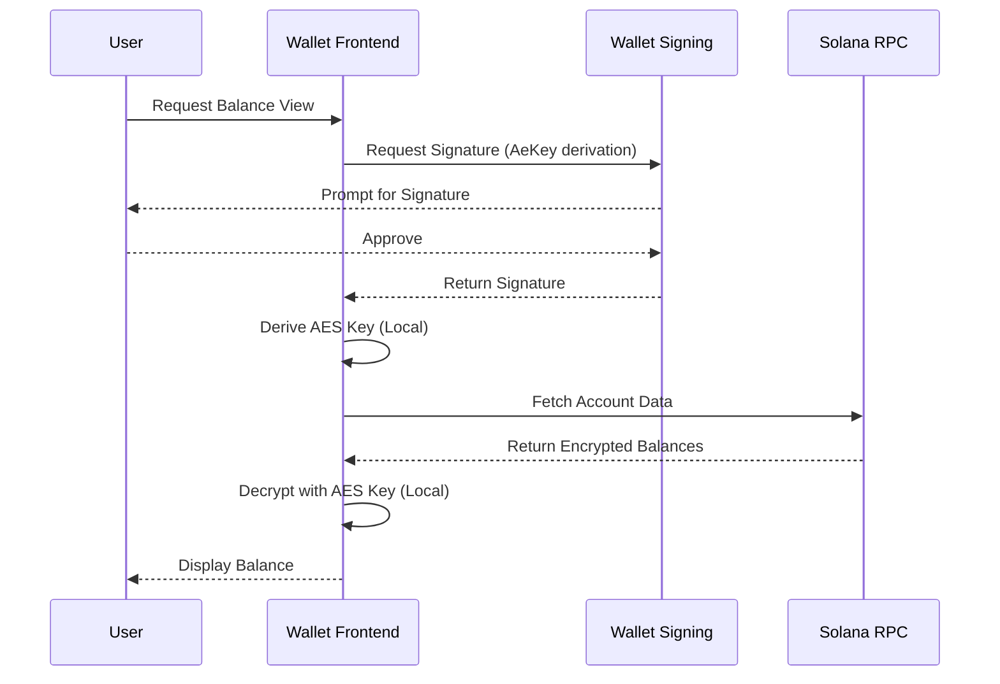
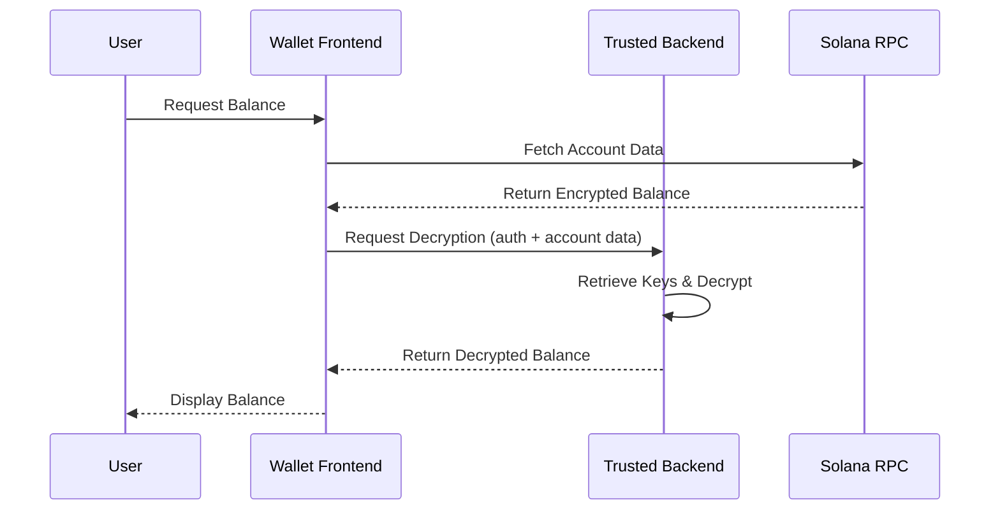
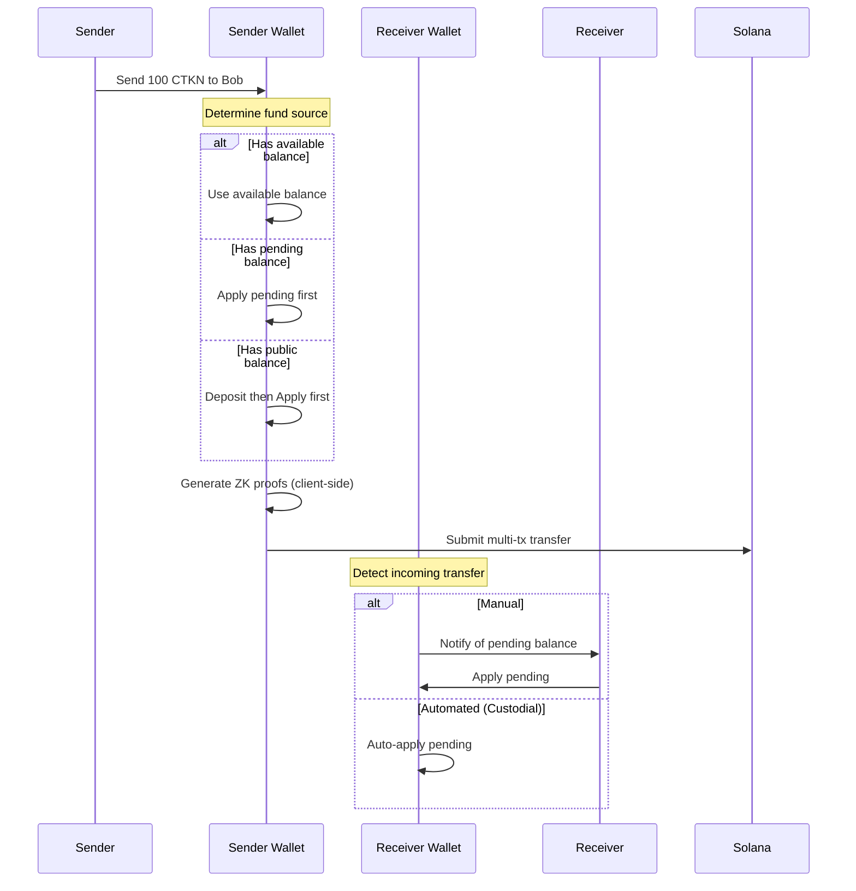

# Wallet Integration Guide

This guide covers how wallet developers can integrate Solana's Confidential Balances feature.

## Overview

Wallets integrating confidential transfers need to handle:

1. **Encryption Key Management** - Deriving and storing ElGamal and AES keys
2. **Balance Display** - Decrypting confidential balances for users
3. **Transaction Building** - Creating confidential transfer transactions with proofs
4. **Pending Balance Handling** - Managing the two-stage balance model

## Encryption Key Management

### Key Derivation Process

Each confidential token account requires two encryption keys derived from wallet signatures:

```
┌─────────────────────────────────────────────────────────────┐
│                  KEY DERIVATION FLOW                        │
├─────────────────────────────────────────────────────────────┤
│                                                             │
│  1. ElGamal Key Derivation                                 │
│     ├─ Seed Message: "ElGamalSecretKey"                   │
│     ├─ Sign: wallet.signMessage(seed + publicSeed)        │
│     └─ Derive: ElGamalKeypair.fromSignature(signature)    │
│                                                             │
│  2. AES Key Derivation                                      │
│     ├─ Seed Message: "AeKey"                               │
│     ├─ Sign: wallet.signMessage(seed + publicSeed)        │
│     └─ Derive: AeKey.fromSignature(signature)              │
│                                                             │
└─────────────────────────────────────────────────────────────┘
```

### Implementation (TypeScript)

```typescript
// Key derivation following SPL Token CLI conventions
async function deriveEncryptionKeys(
  wallet: WalletAdapter,
  tokenAccountAddress: PublicKey
): Promise<{ elgamalKeypair: ElGamalKeypair; aeKey: AeKey }> {
  
  // ElGamal key derivation
  const elgamalSeed = Buffer.concat([
    Buffer.from("ElGamalSecretKey"),
    Buffer.alloc(0) // Empty public seed for CLI compatibility
  ]);
  const elgamalSignature = await wallet.signMessage(elgamalSeed);
  const elgamalKeypair = ElGamalKeypair.fromSignature(elgamalSignature);
  
  // AES key derivation
  const aesSeed = Buffer.concat([
    Buffer.from("AeKey"),
    Buffer.alloc(0)
  ]);
  const aesSignature = await wallet.signMessage(aesSeed);
  const aeKey = AeKey.fromSignature(aesSignature);
  
  return { elgamalKeypair, aeKey };
}
```

### Security Considerations

1. **Hard-coded Seeds** - Use exact seed strings for CLI compatibility
2. **Deterministic Derivation** - Same signature always produces same keys
3. **Key Storage** - Either derive on-the-fly or store encrypted locally
4. **Never Transmit** - Keys must never leave the client

## Balance Display

### Balance Types in Confidential Accounts

| Balance Type | Encryption | Who Can View |
|--------------|------------|--------------|
| **Public** | None | Anyone |
| **Pending** | ElGamal | Owner (decrypt), Auditor |
| **Available** | ElGamal | Owner (decrypt), Auditor |
| **Decryptable Available** | AES | Owner only (efficient) |

### Decryption Flow (Non-Custodial)



### Implementation (TypeScript)

```typescript
async function getConfidentialBalance(
  connection: Connection,
  tokenAccount: PublicKey,
  aeKey: AeKey
): Promise<bigint> {
  // Fetch token account
  const accountInfo = await connection.getAccountInfo(tokenAccount);
  const account = unpackAccount(tokenAccount, accountInfo);
  
  // Get confidential transfer extension
  const ctExtension = getExtension(
    account,
    ExtensionType.ConfidentialTransferAccount
  );
  
  // Decrypt the decryptable available balance
  const decryptedBalance = aeKey.decrypt(
    ctExtension.decryptableAvailableBalance
  );
  
  return decryptedBalance;
}
```

### Custodial Wallet Pattern

For custodial wallets where keys are managed server-side:



## Transaction Building

### Transfer Flow for Wallets



### Multi-Transaction Transfer Structure

Confidential transfers require multiple transactions due to proof sizes:

```
Transaction Bundle (5 transactions):
├─ TX1: Allocate proof context accounts
│   ├─ CreateAccount (range proof)
│   ├─ CreateAccount (equality proof)
│   └─ CreateAccount (ciphertext validity proof)
│
├─ TX2: Encode range proof (largest proof)
│   └─ VerifyBatchedRangeProofU128
│
├─ TX3: Encode remaining proofs
│   ├─ VerifyCiphertextCommitmentEquality
│   └─ VerifyBatchedGroupedCiphertext3HandlesValidity
│
├─ TX4: Execute transfer
│   └─ ConfidentialTransfer instruction
│
└─ TX5: Close proof accounts (reclaim rent)
    ├─ CloseContextState (range)
    ├─ CloseContextState (equality)
    └─ CloseContextState (ciphertext validity)
```

### Proof Generation (WASM)

Using `@solana/zk-sdk` for browser-based proof generation:

```typescript
import init, { 
  ElGamalKeypair,
  BatchedRangeProofU128Data,
  CiphertextCommitmentEqualityProofData,
  BatchedGroupedCiphertext3HandlesValidityProofData 
} from '@solana/zk-sdk/web';

async function generateTransferProofs(
  senderKeypair: ElGamalKeypair,
  recipientPubkey: ElGamalPubkey,
  auditorPubkey: ElGamalPubkey | null,
  amount: bigint,
  currentBalance: bigint
): Promise<TransferProofs> {
  // Initialize WASM
  await init();
  
  // Generate equality proof
  const equalityProof = new CiphertextCommitmentEqualityProofData(
    senderKeypair,
    // ... proof parameters
  );
  
  // Generate ciphertext validity proof
  const validityProof = new BatchedGroupedCiphertext3HandlesValidityProofData(
    // ... proof parameters
  );
  
  // Generate range proof
  const rangeProof = new BatchedRangeProofU128Data(
    // ... proof parameters
  );
  
  return {
    equality: equalityProof.toBytes(),
    validity: validityProof.toBytes(),
    range: rangeProof.toBytes()
  };
}
```

## Pending Balance Management

### Monitoring for Incoming Transfers

Wallets should monitor the `pending_balance_credit_counter` field:

```typescript
async function checkForPendingBalance(
  connection: Connection,
  tokenAccount: PublicKey
): Promise<{ hasPending: boolean; creditCount: number }> {
  const accountInfo = await connection.getAccountInfo(tokenAccount);
  const account = unpackAccount(tokenAccount, accountInfo);
  
  const ctExtension = getExtension(
    account,
    ExtensionType.ConfidentialTransferAccount
  );
  
  const creditCount = Number(ctExtension.pendingBalanceCreditCounter);
  
  return {
    hasPending: creditCount > 0,
    creditCount
  };
}
```

### Auto-Apply Strategy

For better UX, wallets can auto-apply pending balances:

```typescript
async function autoApplyPendingBalance(
  connection: Connection,
  tokenAccount: PublicKey,
  owner: Keypair,
  elgamalKeypair: ElGamalKeypair,
  aeKey: AeKey
): Promise<string | null> {
  const { hasPending, creditCount } = await checkForPendingBalance(
    connection, tokenAccount
  );
  
  if (!hasPending) return null;
  
  // Build apply instruction
  const accountInfo = await connection.getAccountInfo(tokenAccount);
  const account = unpackAccount(tokenAccount, accountInfo);
  const ctExtension = getExtension(account, ExtensionType.ConfidentialTransferAccount);
  
  // Calculate new decryptable balance
  const newDecryptableBalance = calculateNewDecryptableBalance(
    ctExtension,
    elgamalKeypair.secret(),
    aeKey
  );
  
  const instruction = createApplyPendingBalanceInstruction(
    tokenAccount,
    owner.publicKey,
    creditCount,
    newDecryptableBalance,
    TOKEN_2022_PROGRAM_ID
  );
  
  const tx = new Transaction().add(instruction);
  return await sendAndConfirmTransaction(connection, tx, [owner]);
}
```

## UX Recommendations

### 1. Balance Display

```
┌─────────────────────────────────────────────────────────────┐
│                    BALANCE DISPLAY                          │
├─────────────────────────────────────────────────────────────┤
│                                                             │
│  Token: USDC (Confidential)                                │
│                                                             │
│  Available Balance:     1,234.56 USDC                      │
│  Pending Balance:         100.00 USDC  [Apply]             │
│  Public Balance:           50.00 USDC                      │
│  ─────────────────────────────────────                     │
│  Total:                 1,384.56 USDC                      │
│                                                             │
│  [Deposit] [Withdraw] [Transfer]                           │
│                                                             │
└─────────────────────────────────────────────────────────────┘
```

### 2. Transaction Signing

Present multi-tx operations as single action:

```
┌─────────────────────────────────────────────────────────────┐
│                  CONFIRM TRANSFER                           │
├─────────────────────────────────────────────────────────────┤
│                                                             │
│  Sending:     100.00 USDC                                  │
│  To:          Bob.sol                                       │
│  Type:        Confidential Transfer                        │
│                                                             │
│  ⚠️  This will require 5 transaction signatures            │
│                                                             │
│  Estimated fees: ~0.01 SOL                                 │
│                                                             │
│            [Cancel]        [Confirm & Sign All]            │
│                                                             │
└─────────────────────────────────────────────────────────────┘
```

### 3. Error Handling

| Error | User Message | Action |
|-------|--------------|--------|
| Insufficient balance | "Insufficient confidential balance" | Show available vs requested |
| Pending not applied | "Please apply pending balance first" | Auto-apply or prompt |
| Proof generation failed | "Failed to generate transfer proof" | Retry or contact support |
| Transaction timeout | "Transfer incomplete - checking status" | Check and resume |

## Failure Recovery

### Atomic Transfers (Recommended)

Use Jito bundles for atomic execution:

```typescript
import { submitBundle } from 'jito-sdk';

async function atomicConfidentialTransfer(
  transactions: Transaction[],
  payer: Keypair
): Promise<string[]> {
  // Bundle all 5 transactions
  const bundle = transactions.map(tx => ({
    tx: tx.serialize({ verifySignatures: false }),
  }));
  
  // Add Jito tip to one transaction
  const tipIx = createJitoTipInstruction(payer.publicKey);
  transactions[2].add(tipIx);
  
  // Submit bundle
  const result = await submitBundle(bundle);
  
  if (result.status === 'failed') {
    throw new Error('Bundle failed - all transactions rolled back');
  }
  
  return result.signatures;
}
```

### Non-Atomic Recovery

Track progress and recover from partial failures:

```typescript
interface TransferProgress {
  stage: 'proofs' | 'transfer' | 'cleanup' | 'complete';
  proofAccounts: PublicKey[];
  completedTxs: string[];
}

async function recoverTransfer(
  progress: TransferProgress,
  connection: Connection,
  payer: Keypair
): Promise<void> {
  switch (progress.stage) {
    case 'proofs':
      // Retry proof verification
      break;
    case 'transfer':
      // Retry transfer instruction
      break;
    case 'cleanup':
      // Close any remaining proof accounts
      for (const account of progress.proofAccounts) {
        await closeContextState(connection, account, payer);
      }
      break;
  }
}
```

## Testing

### Local Validator Setup

```bash
# Start local validator with token-2022
solana-test-validator \
  --bpf-program TokenzQdBNbLqP5VEhdkAS6EPFLC1PHnBqCXEpPxuEb \
  path/to/spl_token_2022.so \
  --bpf-program ZkE1Gama1Proof11111111111111111111111111111 \
  path/to/zk_elgamal_proof.so
```

### Test Checklist

- [ ] Key derivation produces consistent results
- [ ] Balance decryption shows correct values
- [ ] Deposit → Apply → Transfer → Apply flow works
- [ ] Withdrawal with proof generation succeeds
- [ ] Multi-tx signing UX is clear
- [ ] Error states are handled gracefully
- [ ] Recovery from partial failures works

## Resources

- [Confidential Balances Sample (Rust)](https://github.com/solana-developers/Confidential-Balances-Sample)
- [@solana/zk-sdk NPM Package](https://www.npmjs.com/package/@solana/zk-sdk)
- [Token-2022 CLI Examples](https://github.com/solana-program/token-2022/blob/main/clients/cli/examples/confidential-transfer.sh)
- [QuickNode Integration Guide](https://www.quicknode.com/guides/solana-development/spl-tokens/token-2022/confidential)
